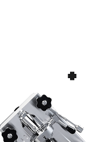

<p align="center">
    
    <br>
    <br>
    <a href="https://github.com/ratatui/ratatui">
        
    </a>
</p>

# MaraTUI

A TUI (Terminal User Interface) application for embedded systems, built with Rust and Ratatui. Designed to display telemetry data and control interface for the **Lelit Mara** coffee machine.

## What it does

MaraTUI provides a multi-screen interface for monitoring and controlling coffee machine parameters:

- **Main Screen**: System status with visual display
- **Dashboard**: Real-time telemetry (temperatures, heating, pump status)
- **Graphs**: Temperature charts and data visualization
- **Debug**: UART communication monitoring
- Real-time telemetry parsing from UART
- Interactive button controls for navigation
- Embedded display support (ESP32)

## What's coming

- UI adjustments: lifetime graphs, design improvements, animations
- Configurable Home Assistant integration (cup count data)
- MQTT broker integration (telemetry data and events broadcasting)

## Development

### Configuration (`.env`)

Create a local `.env` file in project root (it is ignored by git):

```bash
MARATUI_WIFI_SSID=YourWifi
MARATUI_WIFI_PASSWORD=YourPassword

MARATUI_MQTT_ENABLED=true
MARATUI_MQTT_URL=mqtt://broker.emqx.io:1883
MARATUI_MQTT_CLIENT_ID=maratui-dev
MARATUI_MQTT_USERNAME=
MARATUI_MQTT_PASSWORD=
MARATUI_MQTT_TOPIC_PREFIX=mara
```

How it works:

- On ESP32 (`device` feature): `.env` is parsed in [`build.rs`](build.rs), values are embedded at compile time and available in firmware.
- On simulator (`simulator` feature): env values are read at runtime; Wi‑Fi is skipped and host network is used directly for MQTT.

### Simulator (debug)

Before running the simulator, install SDL2 development libraries for your OS. See the
rust-sdl2 installation instructions:
https://docs.rs/crate/sdl2/latest/source/README.md

Then run the simulator with auto-detected platform target:

```
make sim
```

Keyboard controls in simulator can emit debug telemetry, which is published to MQTT (if enabled).

Or use platform-specific cargo aliases directly:

| OS      | Command        |
|---------|----------------|
| Linux   | `cargo sim`    |
| macOS   | `cargo simmac` |
| Windows | `cargo simwin` |

### ESP32 (flash)

```
cargo run --release
```

On device startup the app now:

1. Reads config from `MARATUI_*` env values (embedded at build time)
2. Connects to Wi‑Fi
3. Starts MQTT client
4. Publishes telemetry frames to `<MARATUI_MQTT_TOPIC_PREFIX>/telemetry`

> Note: current `esp-idf-svc` MQTT API in this project exposes MQTT 3.1 / 3.1.1 protocol selection; the implementation uses 3.1.1.
