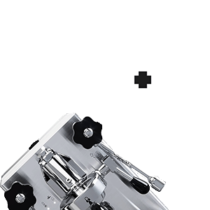
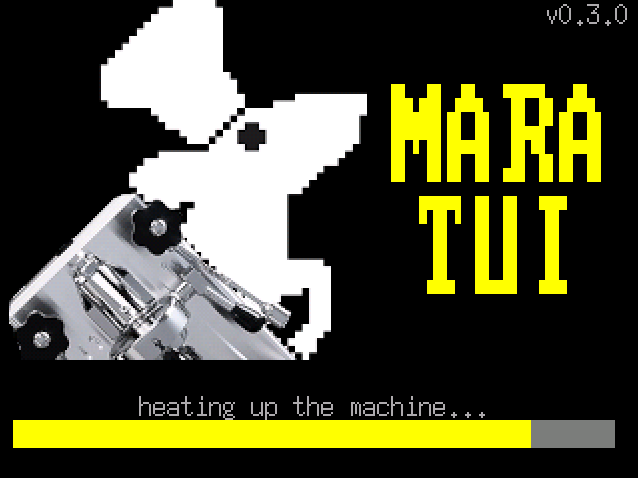
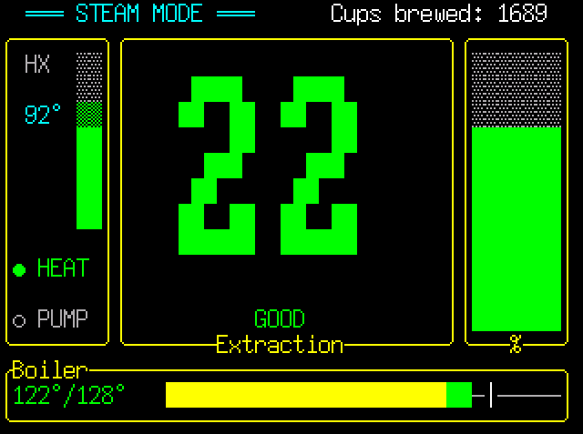
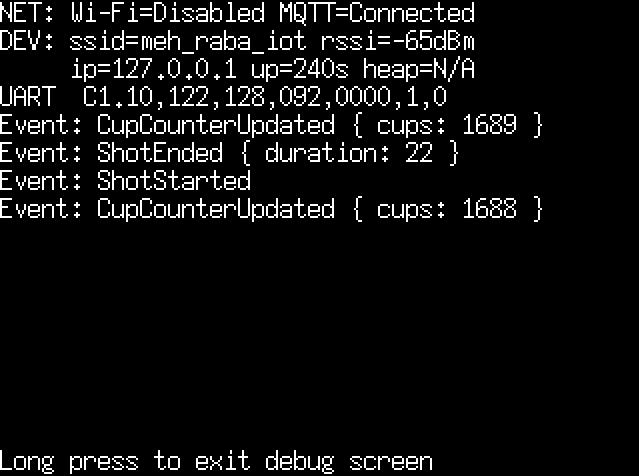

<p align="center">
    
    <br><br>
    <a href="https://github.com/ratatui/ratatui">
        
    </a>
</p>

# MaraTUI

An embedded Rust TUI application for the **Lelit Mara** espresso machine. Runs on an **ESP32** microcontroller driving an **ILI9341 320×240 display** over SPI, reads machine telemetry over UART, and publishes events to MQTT. Includes a host simulator mode for UI development without any hardware.

## Screenshots

| Loading | Dashboard | Debug |
|---------|-----------|-------|
|  |  |  |

## Screens

Navigation cycles between two main screens with a button press. The Debug screen is a hidden overlay.

### Dashboard

The primary screen. Shows all real-time machine data:

- **Mode banner** — COFFEE / STEAM / OFFLINE, color-coded
- **Boiler gauge** — current vs. target temperature with warm→ready color zones and a target marker
- **HX column** — heat-exchanger temperature with a vertical mini-gauge; ideal zone (90–95°C) is always visible
- **HEAT / PUMP indicators** — live status dots
- **Extraction timer** — large countdown in seconds, color shifts white→green→yellow as the shot progresses
- **Shot quality label** — post-extraction assessment (UNDEREXTRACTED / GOOD / PERFECT / LONG SHOT / BLONDING) shown after the pump stops
- **Cup counter** — total shots brewed, received via MQTT

### Graphs

Temperature history chart over a **5-minute rolling window** sampled at 1 Hz:

- Boiler current temperature (yellow)
- Boiler target temperature (red)
- HX temperature (blue)

### Debug (hidden overlay)

Accessible via long press. Shows Wi-Fi and MQTT connection statuses, device info (SSID, RSSI, IP, uptime, free heap), live raw UART frame with activity indicator, and the last 10 telemetry events.

## Getting Started

### Simulator

The simulator runs on your host machine using SDL2 for display emulation — no ESP32 needed.

**Prerequisites:** install SDL2 development libraries for your OS ([installation guide](https://docs.rs/crate/sdl2/latest/source/README.md)).

```bash
make sim          # auto-detects OS
```

Or use platform-specific cargo aliases:

| OS      | Command        |
|---------|----------------|
| Linux   | `cargo sim`    |
| macOS   | `cargo simmac` |
| Windows | `cargo simwin` |

**Keyboard controls:**

| Key          | Action                        |
|--------------|-------------------------------|
| Right / Left | Toggle Dashboard ↔ Graphs     |
| D            | Toggle Debug overlay          |
| Up           | Inject pump-on debug frame    |
| Down         | Inject normal debug frame     |
| Space        | Inject no-water debug frame   |
| M            | Publish manual MQTT event     |

### Device (ESP32)

**Prerequisites:** Rust with the `esp` toolchain channel (pinned in `rust-toolchain.toml`).

```bash
cargo run --release
```

Uses `espflash flash --monitor` as the runner. On startup the firmware:

1. Connects to Wi-Fi using embedded credentials
2. Starts the MQTT client and subscribes to `<prefix>/cup_counter`
3. Streams telemetry to `<prefix>/telemetry` (~1 Hz)
4. Publishes events (shot start/end, water refill, mode change) to `<prefix>/events`
5. Publishes device status (IP, RSSI, uptime, heap) to `<prefix>/status`

## Configuration

Copy `.env.example` to `.env` (git-ignored) and fill in your values:

```bash
cp .env.example .env
```

| Variable | Description |
|---|---|
| `MARATUI_WIFI_SSID` / `_PASSWORD` | Wi-Fi credentials (device build only) |
| `MARATUI_MQTT_ENABLED` | Set `true` to enable MQTT publishing |
| `MARATUI_MQTT_URL` | Broker URL, e.g. `mqtt://192.168.1.x:1883` |
| `MARATUI_MQTT_CLIENT_ID` | Unique client identifier |
| `MARATUI_MQTT_TOPIC_PREFIX` | Topic namespace prefix (default: `mara`) |

> [!NOTE]
> On the ESP32 build (`device` feature), `.env` is parsed by `build.rs` and values are embedded at compile time. On the simulator (`simulator` feature), env values are read at runtime and Wi-Fi is skipped — host networking is used directly for MQTT.

> [!WARNING]
> Wi-Fi and MQTT credentials are stored as plaintext `&'static str` in the flash image. Rotate credentials if the device is shared or its firmware is distributed. See the [Security Considerations](#security-considerations) section below.

## Home Assistant Integration

Build with `--features home-assistant` to enable MQTT Discovery publishing directly from the firmware — no Node-RED or other bridge required. On every MQTT connect, retained discovery configs are published and entities appear in Home Assistant automatically.

```bash
cargo run --release --features home-assistant   # flash
make sim-ha                                      # simulator
```

See [docs/home-assistant.md](docs/home-assistant.md) for the full entity list, MQTT topic reference, and cup counter setup.

## Hardware

Target board: **ESP32 Type-C** with an external **ILI9341** 240×320 TFT display connected over SPI. There is a single physical button.

| Press             | Action                          |
|-------------------|---------------------------------|
| Short             | Toggle Dashboard ↔ Graphs       |
| Short (on loading)| Toggle display backlight        |
| Long              | Enter / exit Debug overlay      |

See [`hardware/`](hardware/) for the KiCad project, PCB renders, Gerber files, and full ESP32 pinout and display wiring.

## Security Considerations

- **Credentials in flash** — Wi-Fi and MQTT credentials are embedded at compile time and extractable from the flash image with standard tools (`strings`, `binwalk`). Rotate if the device is shared.
- **Default broker is public** — `mqtt://broker.emqx.io:1883` is a free public broker with no access control. Set a private broker with authentication before deploying.
- **No TLS** — traffic is plaintext TCP. Switch to `mqtts://` and configure a CA certificate for production use.
- **Open Wi-Fi fallback** — if `MARATUI_WIFI_PASSWORD` is empty, `AuthMethod::None` is used (no encryption). A startup `warn!` names the SSID to make this explicit.

## Roadmap

- Offline mode using NVS storage
