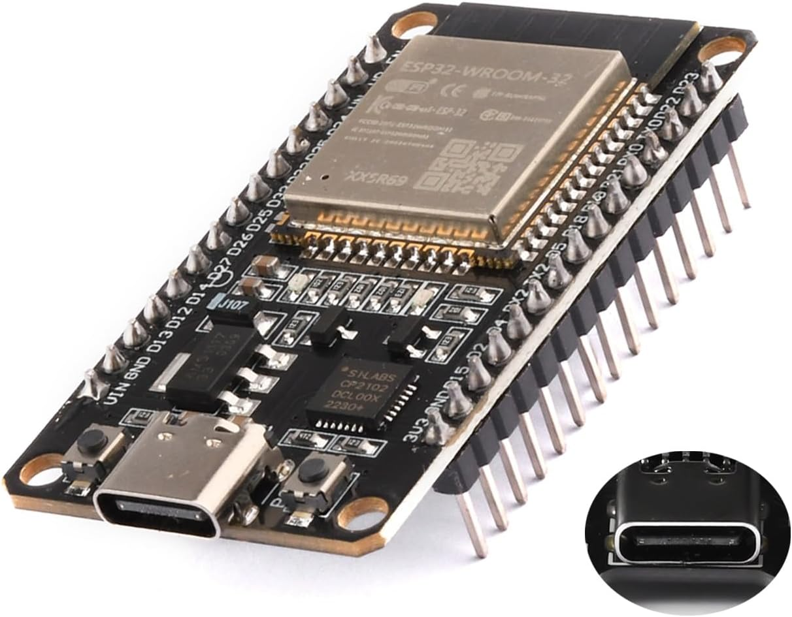
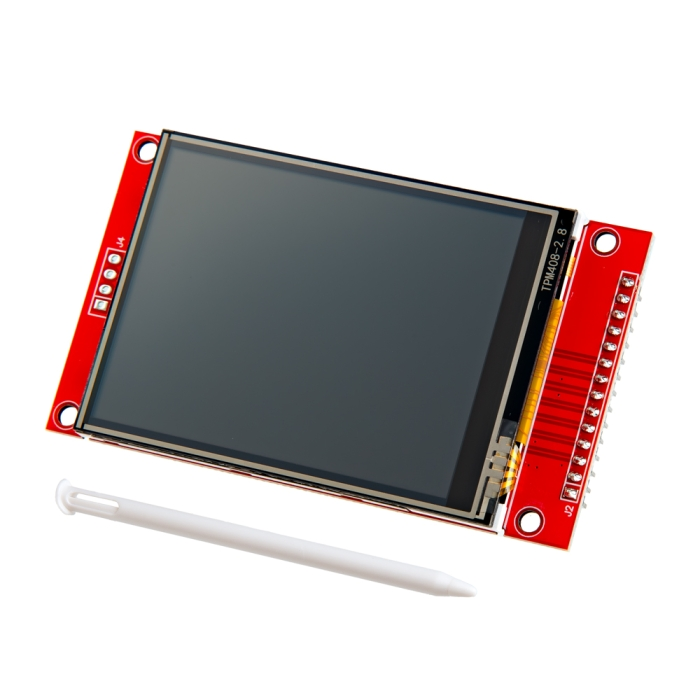

# Hardware Wiring

Target board: **ESP32 Type-C** (generic) with external **ILI9341** 240x320 TFT display.

| ESP32 Type-C | ILI9341 Display |
|:---:|:---:|
|  |  |

## Pinout

### SPI Display (ILI9341)

| Display Pin | ESP32 GPIO | Notes |
|-------------|------------|-------|
| SCK / CLK   | GPIO18     | VSPI CLK |
| SDA / MOSI  | GPIO21     | VSPI MOSI |
| DC / RS     | GPIO23     | Data/Command select |
| CS          | GPIO19     | Chip Select |
| RST / RESET | GPIO22     | Hardware reset |
| LED / BLK   | GPIO14     | Backlight (driven HIGH = on) |
| VCC         | 3.3V       | |
| GND         | GND        | |

### UART (Lelit Mara X telemetry)

| Function | ESP32 GPIO | Notes |
|----------|------------|-------|
| TX       | GPIO17     | UART1 TX |
| RX       | GPIO16     | UART1 RX |

### Button

| Button   | ESP32 GPIO | Notes |
|----------|------------|-------|
| Button 1 | GPIO12     | Internal pull-up enabled |

Button connects GPIO to **GND** through a tactile switch (active LOW, NegEdge detection).
Short press (< 500 ms): toggle Dashboard ↔ Graphs. Long press (≥ 500 ms): toggle Debug screen.
